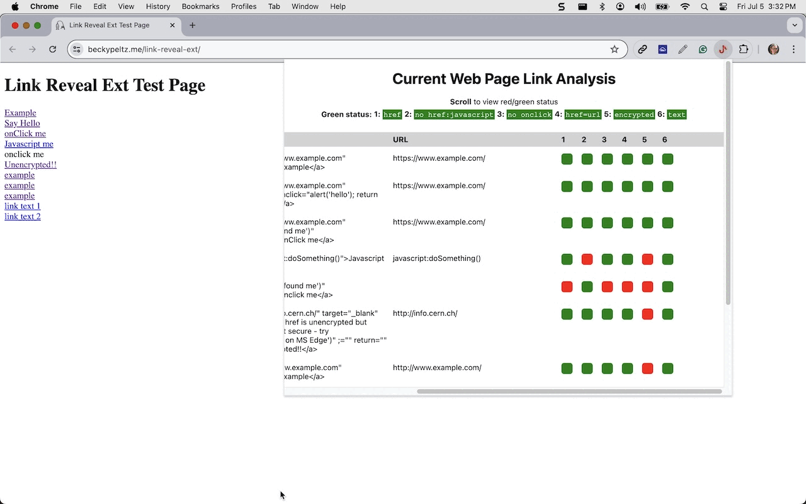
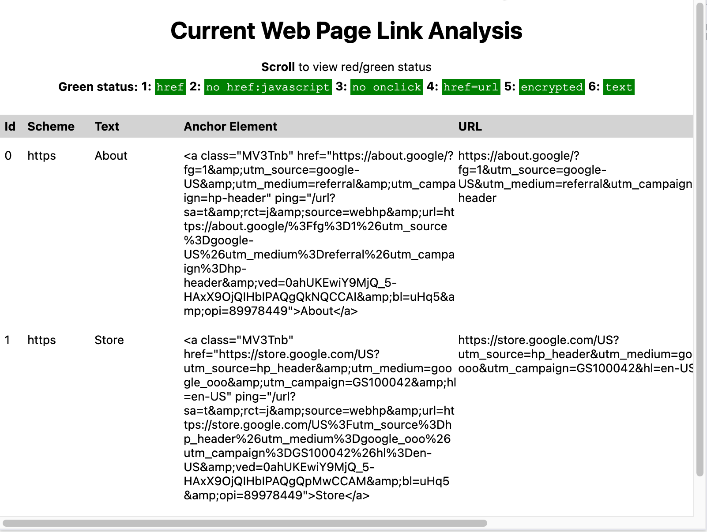

# Create a Chrome Extension

<figure><figcaption></figcaption></figure>

We'll create an extension named **Link Reveal**.  It will be activated by clicking on an icon to the right of the Chrome address bar.  The red hook is the icon that will be associated with this extension.

<figure><figcaption>
Chrome Address Bar with Extension Icons on the Right
</figcaption></figure>

When the user clicks on the icon, this triggers an action that results in a popup window displayed with the **Link Reveal** report of all the links in the current web page.

<figure><figcaption>
Link Reveal Extension Report
</figcaption></figure>

Creating a Chrome extension starts with understanding the requirements that files containing code and configuration must meet.  Knowing how Chrome communicates between the user web page and the extension web page is essential. &#x20;
