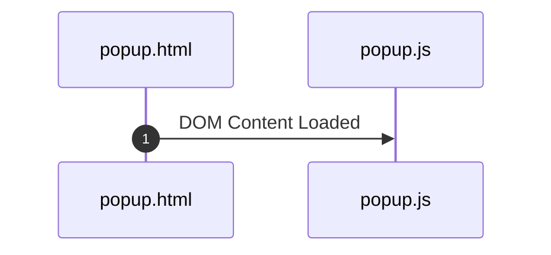
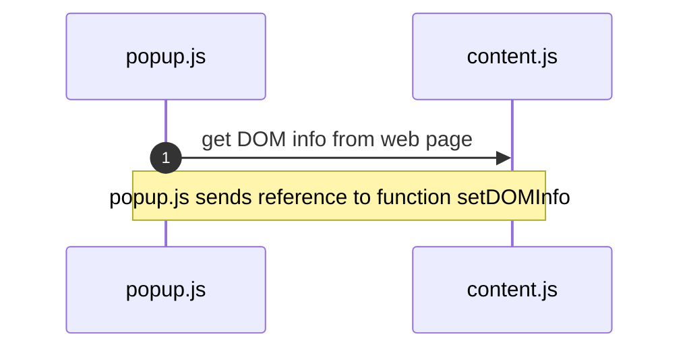
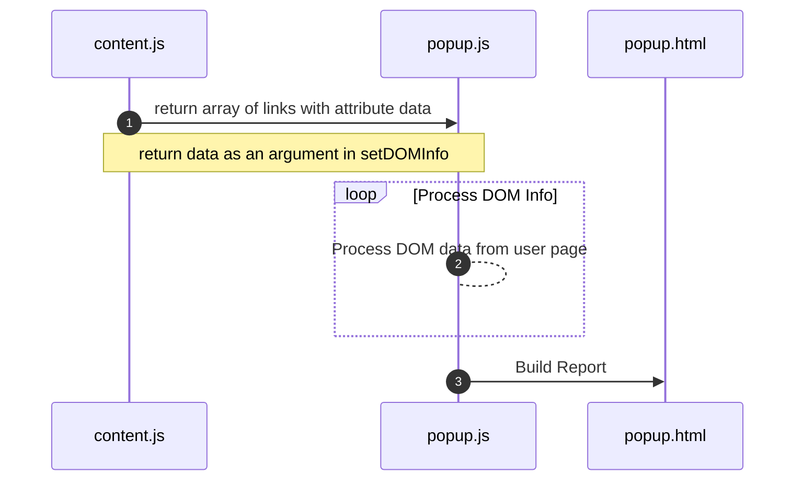

# Code the Extension

### popup.html




The HTML for the popup provides the structure for the final report.  The files `popup.css` and  `popup.js` are linked to this file to give style and JavaScript.  The `popup.js` code will add more elements to this document based on data from the content script and is the file used to configure the manifest action. &#x20;

When the user clicks the extension icon, the HTML is loaded, and a DOMContentloaded event is fired.&#x20;

```html
<!DOCTYPE html>
<html>

<head>
    <meta charset="utf-8">
    <meta name="viewport" content="width=device-width">
    <title>Link Reveal</title>
    <link href="popup.css" rel="stylesheet" type="text/css" />

</head>

<body>
    <div class="autoscroll">
        <h1>Current Web Page Link Analysis</h1>
        <div id="nodata-msg" class=" hide">
            <h2 class="nodata">There are no anchor tags on this page.</h2>
            <p>Try a page refresh in case the page was put to sleep. </p>
        </div>
        <table id="status-def" class="fixed">
            <caption><b>Scroll</b> to view red/green status</caption>
            <tr>
                <td><b>Green status:</b></td>
                <td><b>1:</b> <span class="info-button-green">href</span></td>
                <td><b>2:</b> <span class="info-button-green">no href:javascript</span></td>
                <td><b>3:</b> <span class="info-button-green">no onclick</span></td>
                <td><b>4:</b> <span class="info-button-green">href=url</span></td>
                <td><b>5:</b> <span class="info-button-green">encrypted</span></td>
                <td><b>6:</b> <span class="info-button-green">text</span></td>
            </tr>
        </table>
    </div>
    <div id="links" class="container">
        <div class="grid header row">
            <div class="data">Id </div>
            <div class="data">Scheme </div>
            <div class="data">Text</div>
            <div class="data">Anchor Element</div>
            <div class="data">URL</div>
            <div class="data">1</div>
            <div class="data">2</div>
            <div class="data">3</div>
            <div class="data">4</div>
            <div class="data">5</div>
            <div class="data">6</div>
        </div>
    </div>
    <script src="popup.js"></script>
</body>

</html>
```

### popup.js

The extension window popup will request content from the extension `content.js` , which will be injected into the current web page.  The `popup.js` will request content from the inject content code.  It does this in line 79 with `chrome.tabs.query`. This query returns a number that identifies the tab.  In line 86, a message is sent that Chrome passes to the content code.  There are three arguments in the request:

1. tab id
2. an object that informs the receiver where it comes from and the subject &#x20;
3. a reference to the function `setDOMInfo` defined on line 63






```javascript
const isUnencrypted = (scheme) => {
  return scheme.toLowerCase() == "http";
};
const containsJavaScript = (javascriptHref, useOnclick) => {
  return javascriptHref || useOnclick;
};
const createInfoButton = (flag) => {
  let button = document.createElement("button");
  button.classList.add("info-button");
  if (flag) {
    button.classList.add("info-button-green");
  } else {
    button.classList.add("info-button-red");
  }
  return button;
};
const addInfoButton = (data,row) => {
  col = document.createElement("div");
  col.append(createInfoButton(data));
  row.append(col);
};
const addTextContent = (data,row) =>{
  let col = document.createElement("div");
  col.textContent = data;
  row.append(col);
}
const addData = (i, row, data) => {
  addTextContent(i,row);
  addTextContent(data.scheme,row);
  addTextContent(data.text,row);

  // add anchor element string
  col = document.createElement("div");
  col.classList.add("anchor-el");
  col.textContent = data.anchorElString;
  row.append(col);

  // add href/URL
  col = document.createElement("div");
  col.textContent = data.href;
  row.append(col);
  row.classList.add("href");

  // add info buttons
  addInfoButton(data.hasHref,row);
  addInfoButton(data.hasNoJavascriptInHref,row);
  addInfoButton(data.hasHref,row);
  addInfoButton(data.hasHrefUrl,row);
  addInfoButton(data.isEncrypted,row);
  addInfoButton(data.hasText,row);
 
};
const appendRow = (i, data) => {
  const linkTable = document.querySelector("#links");
  let row = document.createElement("div");
  row.classList.add("row");
  row.classList.add("grid");
  linkTable.append(row);
  addData(i, row, data);
};

// Update the relevant fields with the new data.
const setDOMInfo = (info) => {
  if (info){
    for (let i = 0; i < info.length; i++) {
      appendRow(i, info[i]);
    }
  } else {
    //no anchors elements on the page
    document.querySelector("#nodata-msg").classList.remove("hide");
    document.querySelector("#status-def").classList.add("hide");
    document.querySelector("#links").classList.add("hide");
  }
 
};

window.addEventListener("DOMContentLoaded", () => {
  // query for the active tab...
  chrome.tabs.query(
    {
      active: true,
      currentWindow: true,
    },
    (tabs) => {
      // send a request to content for the DOM info
      chrome.tabs.sendMessage(
        tabs[0].id,
        { from: "popup", subject: "DOMInfo" },
        setDOMInfo
      );
    }
  );
});
```


### content.js

The injected code gets all the anchor elements and extracts the scheme, URL, and the entire anchor element as a string. It then does additional processing on each link to look for possible issues, such as JavaScript being executed in an onclick, no href, or an encrypted URL. These could all be indicators that there is a potential issue with the link. &#x20;

The processing in the content script reads a Nodelist of anchor elements from the DOM.  It then loads attributes and analysis into an array of objects.  This array is returned to the `popup.js` by calling the `setDOMInfo` function with the Array of objects.  The call is issued on line 39 with the `sendResponse` function.  If no anchor elements are found, the sendReponse notifies the calling function that nothing is found by returning `undefined` on line 10.

The `setDOMInfo` then calls a function that uses the data to build out a report for the user that is displayed in `popup.html`.




```javascript
// Listen for messages from the popup.
// params are request object showing where from and subject, sender knows the tab if needed,
// sendReponse is the name of the function in popup to send the DOM data to
chrome.runtime.onMessage.addListener((request, sender, sendResponse) => {
  // First, validate the message's structure.
  if (request.from === "popup" && request.subject === "DOMInfo") {
    const schemeRegex = /^([a-z][a-z0-9+\-.]*):/;
    const anchors = document.getElementsByTagName("a");
    if (!anchors[0]) {
      sendResponse(undefined);
    } else {
      const links = new Array(anchors.length);

      for (let i = 0; i < links.length; i++) {
        let javascriptInHref =
          anchors[i].attributes.href &&
          anchors[i].attributes.href.value.indexOf("javascript") > -1
            ? true
            : false;
        let hasOnClick = anchors[i].attributes.getNamedItem("onclick") != null;
        let schemeMatch = anchors[i].href.match(schemeRegex);
        let schemeValue = schemeMatch ? schemeMatch[1] : "";
        let hrefValue = anchors[i].href;
        let textValue = anchors[i].text;
        links[i] = {
          href: hrefValue,
          text: textValue,
          scheme: schemeValue,
          hasHref: hrefValue ? true : false,
          hasNoJavascriptInHref: !javascriptInHref,
          hasNoOnclick: !hasOnClick,
          hasHrefUrl: hrefValue ? true : false,
          isEncrypted:
            schemeValue && schemeValue.indexOf("https") > -1 ? true : false,
          hasText: textValue ? true : false,
          anchorElString: anchors[i].outerHTML,
        };
      }
      sendResponse(links);
    }
  }
});
```


### Debugging popup.js and content.js

Use the Chrome Dev tools inspector to debug both of the JavaScript files.  Start by adding `console.log` statements to the code.  The logs for the popup code are in the inspector for the popup.html page.  The logs for the content code are in the inspector for the current web page.  If a more detailed code walkthrough is needed, you can set breakpoints or the `debugger` command in the code.


