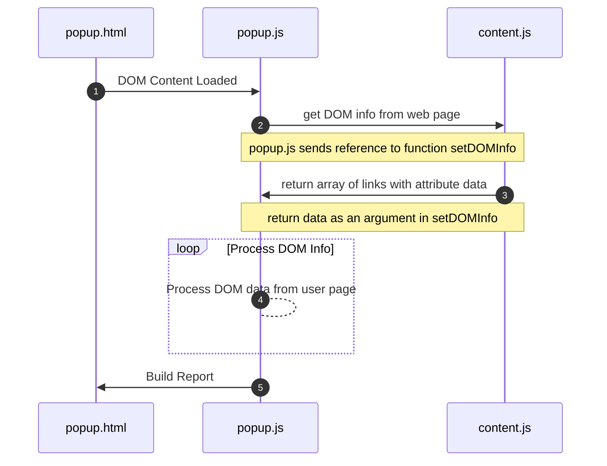

# Design the Extension

### Chrome Manifest

Chrome extensions require a manifest. The manifest provides information on the filenames of code and images and specifies permissions for accessing the user's code.

The manifest starts with a `name`, `description`, and `version`.  If the extension needs to be updated, the`version` must be incremented.  The `manifest_version` is set by Chrome.  The current manifest version, as of this writing, is `3`.  The `icons` The list at the bottom of this manifest shows the relative location of images in the code package submitted for publishing.  These images create the button next to the Chrome address bar.  For **Link Reveal,** this is the red hook.  The different sizes are used to ensure visibility on different-sized devices.

```json
{
    "name": "Link Reveal",
    "description": "Reveal Anchor Tag URLs",
    "version": "1.0.2",
    "manifest_version": 3,
    "permissions": [
        "activeTab"
    ],
    "content_scripts": [
    {
        "matches": [
            "<all_urls>"
        ],
        "js": [
            "content.js"
        ],
        "all_frames": false
        }
    ],
    "action": {
        "default_popup": "popup.html",
        "default_icon": {
            "16": "images/url-16.png",
            "32": "images/url-32.png",
            "48": "images/url-48.png",
            "128": "images/url-128.png",
            "512": "images/url-512.png"
        }
    },
    "icons": {
        "16": "images/url-16.png",
        "32": "images/url-32.png",
        "48": "images/url-48.png",
        "128": "images/url-128.png",
        "512": "images/url-512.png"
    }
}
```

### Permissions

The `permissions` key provides information on how permissions are granted to the extension.  In this case, listing only `activeTab`, the extension requests permission to access the web page content of the active tab.  This means the extension will act only on the web page the user is viewing when they click the extension icon.

### Content Scripts

The `content_scripts` are files with code that will access the user's web page.  Any code in a content script will be injected into the web that the user is currently viewing.  If an extension needs to access the DOM of the current web page, this code will be located in a content script.

The `matches` key in `content_scripts` references an array that lists what URLs can take the content script injection.  In this case,  the value`"<all_urls>"` indicates that this content script can be injected into any URL.   This is a broad permission.  Chrome will accept a link to a Security Policy that states what data will be extracted from the page and how it will be used.  The Security Policy will help to get the extension published quickly.

The `js` key specifies the file name containing the code that will be injected into the web page to extract data.  The name of the file is `content.js`.

The `all_frames` key indicates using `true` or `false` whether the code can be injected into all frames on a web page.  Only frame 0 will be processed for **Link Reveal** if multiple frames are on the web page.

### Action

The `action` The key names the HTML file that will pop up when the extension icon is clicked.  In this case, the name of the file is `popup.html`.  The default icons are specified and the same as those listed by the icon key.

### Data Flow

The manifest has named two files:  `content.js` and `popup.html`.  The HTML file will need JavaScript to turn the data received from the content script into the DOM element that makes up the report.  This JavaScript can be included in the HTML or linked to another file.  Link Reveal will use a separate `popup.js` file to hold the code that turns the data from the user web page into a report rendered in `popup.html`.

The sequence diagram below shows the flow that is carried out when the user clicks on the icon. &#x20;

The HTML document is alerted that the DOM Content has been loaded.  The `popup.js` code requests from `content.js` to get the information about links from the current page.  The request includes the name of the function `setDOMInfo` in `popup.js` that will be used to return data from the content script to the action script. The content page executes a `document.getElementsByTagName("a")` to retrieve all the anchor tags.  This information is turned into an array of objects that summarize the attributes of the links found.  The `setDOMInfo` function creates the HTML to construct the report rendered in `popup.html`.




