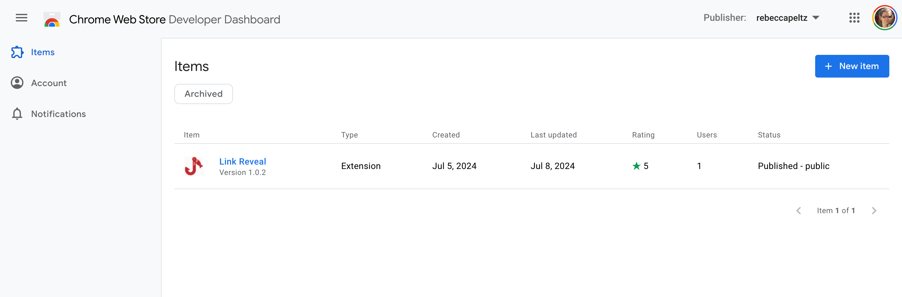
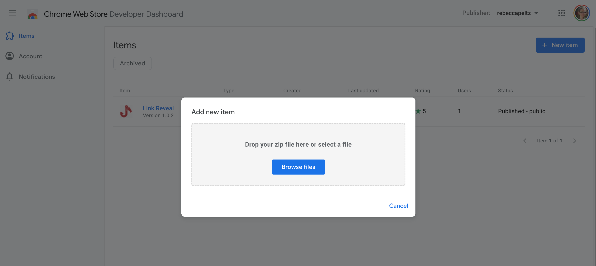
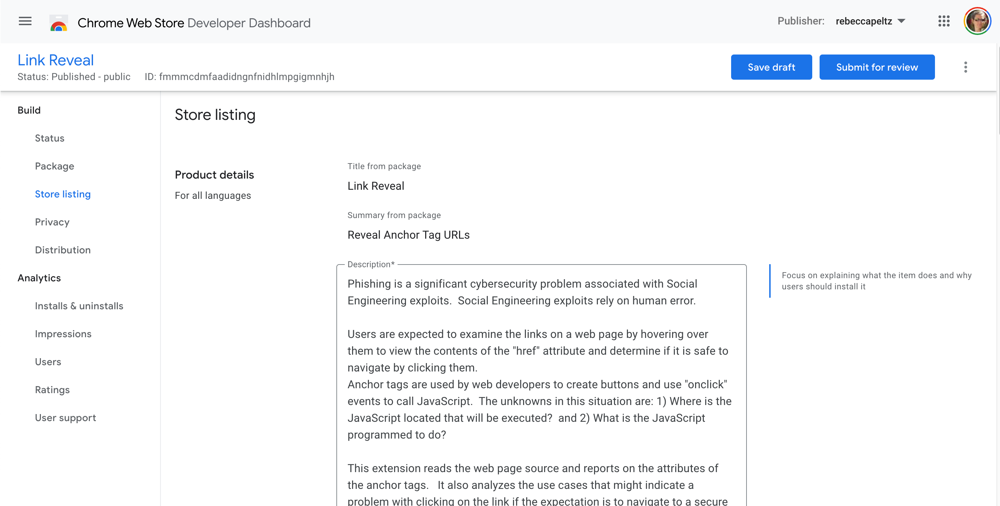
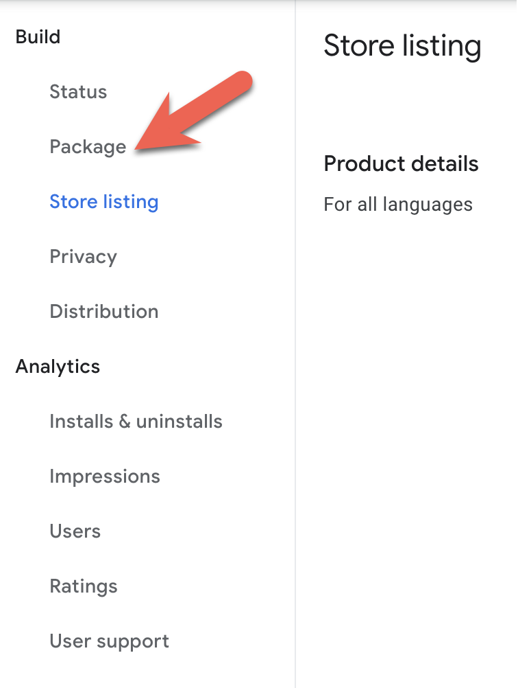

# Publish the Extension

### Chrome Developer Console

We must set up an account and access the [Chrome Web Store Developer Dashboard](https://chrome.google.com/webstore/devconsole/) to publish an extension.

<figure><figcaption><p>Chrome Developer Dashboard with entry for Extension</p></figcaption></figure>

### Prepare Images for Chrome Web Store Listing

We need to prepare some Graphic Assets: &#x20;

1. The store icon should be 128x128 pixels and located in the Zip file. The icon should be 96x96 with 16 transparent pixels per side. It must be in PNG format. It should look OK in light an dark backgrounds.  It will appear next to the Chrome address bar with other Chrome Extension icons.
2. You can optionally include a video by supplying a link that will be posted on the Store website.
3. Provide at least one and up to five screenshots that will be displayed with the store listing. These must be 1280x800 or 640x400.  The format must be JPEG or 24-bit PNG.
4. A small promo title image that is 480x280 with a JPEG or 24-bit PNG format.
5. A marquee promo file that is 1400x560 with a JPEG or 24-bit PNG format.

### Create a Zip File

The folder that is zipped for **Link Reveal** looks like this:

<figure><figcaption><p>Folder containing manifest, code and image for extension</p></figcaption></figure>

There are a couple of files that have not been discussed yet.  The `index.html` renders a web page containing a lot of different variations on links to test with.  The `nolinks.html` contains no links.  When there are no links on the user's web page, a message will appear indicating that no links were found and that a page refresh might help.  This is because some pages get put to sleep, and if the user returns to a page, the refresh will help make it available for injections.  There are two markdown files:  README and a PrivacyPolicy.  The README contains notes on the application.  The **PrivacyPolicy** will be served from **github.io**, and the link will be supplied to Google via the publishing process.

### Prepare a Security Policy Document Link

Questions arise about the security and permissions required by the extension. Because it requests access to all URLs, there is a security policy. The extension is stored in the GitHub repository that holds the code and is rendered with GitHub pages. The link is shared in the Privacy section of the publishing process. When the extension is submitted, it will be reviewed, and more requirements may be asked for.

The contents of the security policy are shown below:

```
This extension reads the current web pages and extracts link information.
It uses the JavaScript code document.getElementsByTagName("a") to get a list
of all HTML code that defines the anchor elements on the web page. The extension
processes this data, and immediately provides a popup summarizing this data to
the user, ensuring a seamless and efficient experience.

The extension does not save, send, or otherwise transport the data out of the
context of the popup page. It gathers it only to help the user see
the data behind the links they might click.

No promotional emails or connections to the user will arise from using this
extension. The data will not be shared in any way with anyone except the
extension user when they use the extension.

The source code for the web page can be found here: https://github.com/rebeccapeltz/link-reveal-ext
```

### Publish Process

When we click the **New Item** button, we're prompted to upload the zip file containing the extension code.

<figure><figcaption><p>Upload zip file</p></figcaption></figure>

Once the code is uploaded, we provide information for the store listing and share privacy considerations. &#x20;

<figure><figcaption><p>Publish process</p></figcaption></figure>

Note that if we change the extension code or configuration, we need to update the version in the manifest file and then click Package on the left menu to upload a new zip file. &#x20;

<figure><figcaption><p>Upload modified core using Package</p></figcaption></figure>

