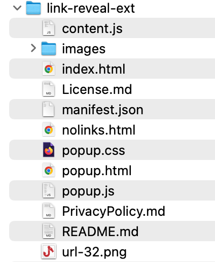

# Resources

### Start the Publish Process

Begin by zipping the folder that contains the manifest, code and images.  We need to create images&#x20;

#### Zipped Folder

The folder that is zipped for **Link Reveal** looks like this:

<figure><figcaption>
Link Reveal Folder
</figcaption></figure>

There are a couple of files that have not been discussed yet.  The `index.html` renders a web page containing a lot of different variations on links to test with.  The `nolinks.html` contains no links.  When there are no links on the user's web page, a message will appear indicating that no links were found and that a page refresh might help.  This is because some pages get put to sleep, and if the user returns to a page, the refresh will help make it available for injections.

### Publish


Create an account and manage extensions on the dashboard

